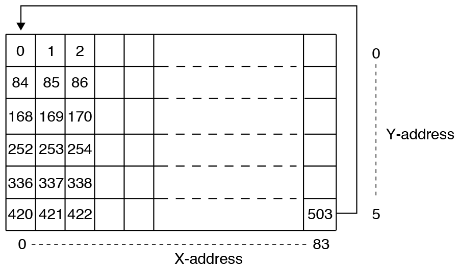
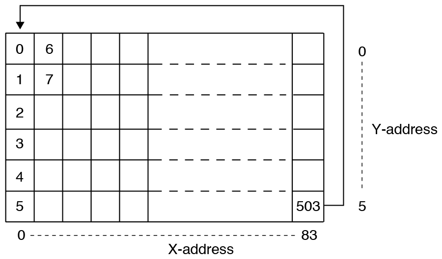

# Addressing

The display is 84x48 pixels, 504 bytes, divided into 6 banks of 84x8 pixels, 84 bytes each.

You can configure the display to draw consecutive bytes moving horizontally or vertically.

In both modes, each byte is drawn to the display as a vertical column of 8 pixels.
You are unable to draw 8 horizontal pixels from a single byte.
The least significant bit in each byte is displayed at the top.

In horizontal mode, every subsequent byte is drawn beside the current byte until the end of the bank, then moves to the start of the next bank.


In vertical mode, every subsequent byte is drawn in the same column on the next bank until the last bank, where it wraps back to the first bank and moves across one column.


Changing the addressing mode does not affect what is already displayed on the screen. It only affects the position the next bytes are drawn.

## Example 1

The Nokia example image:


### Horizontal addressing mode:



Horizontal addressing is compatible with framebuf.MONO_VLSB

```python
0x80, 0x00, 0x00, 0x80, 0x00, 0x00, 0x80, 0x00, 0x00, 0x80, 0x00, 0x00, 0x80, 0x00, 0x00, 0x80, 0x00, 0x00, 0x80, 0x80, 0x40, 0x40, 0x40, 0x80, 0x80, 0xC0, 0xC0, 0x40, 0xC0, 0xA0, 0xE0, 0xC0, 0xE0, 0xE0, 0xF0, 0xF0, 0xF8, 0xF8, 0xF8, 0xFC, 0xFC, 0xFE, 0xEE, 0xF4, 0xF0, 0xF0, 0x70, 0x30, 0x00, 0x80, 0x00, 0x00, 0x80, 0x00, 0x0C, 0x9C, 0x1C, 0x38, 0xB8, 0x38, 0x38, 0xB8, 0xF8, 0xF0, 0xF0, 0xF0, 0xF0, 0xF0, 0xF0, 0xF0, 0xF0, 0xF0, 0xF0, 0xF0, 0xF0, 0xF0, 0xF0, 0xF0, 0xF0, 0xF0, 0xF8, 0xF8, 0xF8, 0xF8,
0x88, 0x20, 0x8A, 0x20, 0x08, 0x22, 0x08, 0x00, 0x0A, 0x00, 0x00, 0x02, 0x80, 0x71, 0xBA, 0xDA, 0xFD, 0xDD, 0xED, 0xDE, 0xEE, 0xF7, 0xFF, 0xFB, 0xFD, 0xFD, 0xFE, 0xFF, 0x7F, 0x3F, 0x1F, 0x9F, 0x3F, 0x7F, 0x6F, 0x0F, 0xAF, 0x1F, 0xBF, 0x3E, 0x3C, 0x7A, 0x78, 0x70, 0x22, 0x88, 0xA0, 0x2A, 0x80, 0x08, 0x62, 0xE0, 0xE0, 0xF2, 0xF0, 0x58, 0xDA, 0xF8, 0xFC, 0x92, 0xFE, 0xFF, 0xFF, 0xD3, 0xFF, 0xFD, 0xF3, 0xE1, 0xF0, 0xF9, 0x7F, 0xBF, 0x3F, 0x8F, 0x2F, 0x4F, 0xAF, 0x0F, 0x4F, 0xA7, 0x0F, 0xAF, 0x87, 0x2F,
0x82, 0x80, 0x20, 0xC0, 0x80, 0x80, 0x50, 0x40, 0xC4, 0xD0, 0xA0, 0xE8, 0xE4, 0xEA, 0xFF, 0xFB, 0xFD, 0xFF, 0xFF, 0xFF, 0xFF, 0xFF, 0xEF, 0x4F, 0x27, 0x53, 0xA8, 0x54, 0x29, 0x4A, 0xB5, 0x82, 0xAC, 0xA1, 0x8A, 0xB6, 0x50, 0x4D, 0x32, 0xA4, 0x4A, 0xB4, 0xA9, 0x4A, 0x52, 0xB4, 0xAA, 0x45, 0xA8, 0xDA, 0x22, 0xAC, 0xD2, 0x2A, 0x52, 0xA8, 0x52, 0x4C, 0xB0, 0xAD, 0x43, 0x5B, 0xB3, 0x45, 0xA8, 0x5B, 0xA3, 0xAB, 0x55, 0xA8, 0x52, 0x54, 0xA9, 0x56, 0xA8, 0x45, 0xBA, 0xA4, 0x49, 0x5A, 0xA2, 0x54, 0xAA, 0x52,
0xFE, 0xFF, 0xFF, 0xFE, 0xFD, 0xFF, 0xFF, 0xFF, 0xFE, 0xFF, 0xFF, 0xFF, 0xFF, 0xFF, 0xFF, 0xFF, 0xFF, 0xFF, 0xFF, 0xFF, 0xFF, 0x7F, 0xFF, 0xFE, 0xBF, 0x7F, 0xBF, 0xBF, 0xFF, 0xDF, 0xBF, 0x5F, 0xDF, 0x7F, 0xDF, 0x7F, 0xDF, 0xAF, 0x7F, 0xEE, 0x8E, 0xF1, 0x6E, 0x99, 0xF7, 0x6A, 0xDD, 0xB2, 0x6E, 0xD5, 0x7A, 0xD7, 0xAC, 0x75, 0xDB, 0x6D, 0xD5, 0x7A, 0xD7, 0xAC, 0x7B, 0xE5, 0xDE, 0xA9, 0x77, 0xDA, 0xB5, 0xEE, 0x59, 0xB6, 0xEB, 0xDD, 0xB6, 0x69, 0xD6, 0xBF, 0xE8, 0x55, 0xEF, 0xB9, 0xD6, 0xED, 0xB5, 0x5B,
0xAB, 0xFF, 0xFD, 0xF7, 0xFF, 0x01, 0x01, 0x01, 0x01, 0xE1, 0xC1, 0x81, 0x03, 0x05, 0x0F, 0x1D, 0x2F, 0x7E, 0x01, 0x00, 0x01, 0x01, 0xFF, 0xFE, 0x03, 0x01, 0x01, 0x00, 0xF1, 0xF0, 0xF1, 0x71, 0xF1, 0xF1, 0xB1, 0xF1, 0x01, 0x01, 0x01, 0x03, 0xFE, 0xFF, 0x01, 0x01, 0x01, 0x01, 0xBE, 0x1B, 0x0D, 0x07, 0x03, 0x41, 0xE1, 0xF1, 0xF9, 0x6D, 0xFF, 0xFF, 0x00, 0x01, 0x01, 0x01, 0xFF, 0xFF, 0xEB, 0x3E, 0x0D, 0x03, 0x01, 0x41, 0x71, 0x70, 0x41, 0x01, 0x03, 0x0E, 0x3B, 0xEF, 0xFE, 0xFB, 0xEE, 0x7D, 0xF7, 0xFF,
0xFF, 0xFF, 0xFF, 0xFE, 0xFF, 0xF0, 0xF0, 0xF0, 0xF0, 0xFF, 0xFF, 0xFF, 0xFF, 0xFE, 0xFC, 0xF8, 0xF0, 0xF0, 0xF0, 0xF0, 0xF0, 0xF0, 0xFF, 0xFF, 0xF8, 0xF0, 0xF0, 0xF0, 0xF1, 0xF1, 0xF1, 0xF1, 0xF1, 0xF1, 0xF1, 0xF1, 0xF0, 0xF0, 0xF0, 0xF8, 0xFF, 0xFF, 0xF0, 0xF0, 0xF0, 0xF0, 0xFF, 0xFF, 0xFE, 0xFC, 0xF8, 0xF0, 0xF0, 0xF1, 0xF3, 0xF7, 0xFF, 0xFF, 0xF0, 0xF0, 0xF0, 0xF0, 0xFF, 0xF3, 0xF0, 0xF0, 0xF0, 0xFC, 0xFC, 0xFC, 0xFC, 0xFC, 0xFC, 0xFC, 0xFC, 0xF0, 0xF0, 0xF0, 0xF3, 0xFF, 0xFF, 0xFF, 0xFF, 0xFF,
```

```python
import pcd8544
from machine import Pin, SPI

spi = SPI(1)
spi.init(baudrate=2000000, polarity=0, phase=0)
cs = Pin(2)
dc = Pin(15)
rst = Pin(0)
bl = Pin(12, Pin.OUT, value=1)

lcd = pcd8544.PCD8544(spi, cs, dc, rst)

lcd.init(horizontal=True)
lcd.data(bytearray(b'\x80\x00\x00\x80\x00\x00\x80\x00\x00\x80\x00\x00\x80\x00\x00\x80\x00\x00\x80\x80\x40\x40\x40\x80\x80\xC0\xC0\x40\xC0\xA0\xE0\xC0\xE0\xE0\xF0\xF0\xF8\xF8\xF8\xFC\xFC\xFE\xEE\xF4\xF0\xF0\x70\x30\x00\x80\x00\x00\x80\x00\x0C\x9C\x1C\x38\xB8\x38\x38\xB8\xF8\xF0\xF0\xF0\xF0\xF0\xF0\xF0\xF0\xF0\xF0\xF0\xF0\xF0\xF0\xF0\xF0\xF0\xF8\xF8\xF8\xF8\x88\x20\x8A\x20\x08\x22\x08\x00\x0A\x00\x00\x02\x80\x71\xBA\xDA\xFD\xDD\xED\xDE\xEE\xF7\xFF\xFB\xFD\xFD\xFE\xFF\x7F\x3F\x1F\x9F\x3F\x7F\x6F\x0F\xAF\x1F\xBF\x3E\x3C\x7A\x78\x70\x22\x88\xA0\x2A\x80\x08\x62\xE0\xE0\xF2\xF0\x58\xDA\xF8\xFC\x92\xFE\xFF\xFF\xD3\xFF\xFD\xF3\xE1\xF0\xF9\x7F\xBF\x3F\x8F\x2F\x4F\xAF\x0F\x4F\xA7\x0F\xAF\x87\x2F\x82\x80\x20\xC0\x80\x80\x50\x40\xC4\xD0\xA0\xE8\xE4\xEA\xFF\xFB\xFD\xFF\xFF\xFF\xFF\xFF\xEF\x4F\x27\x53\xA8\x54\x29\x4A\xB5\x82\xAC\xA1\x8A\xB6\x50\x4D\x32\xA4\x4A\xB4\xA9\x4A\x52\xB4\xAA\x45\xA8\xDA\x22\xAC\xD2\x2A\x52\xA8\x52\x4C\xB0\xAD\x43\x5B\xB3\x45\xA8\x5B\xA3\xAB\x55\xA8\x52\x54\xA9\x56\xA8\x45\xBA\xA4\x49\x5A\xA2\x54\xAA\x52\xFE\xFF\xFF\xFE\xFD\xFF\xFF\xFF\xFE\xFF\xFF\xFF\xFF\xFF\xFF\xFF\xFF\xFF\xFF\xFF\xFF\x7F\xFF\xFE\xBF\x7F\xBF\xBF\xFF\xDF\xBF\x5F\xDF\x7F\xDF\x7F\xDF\xAF\x7F\xEE\x8E\xF1\x6E\x99\xF7\x6A\xDD\xB2\x6E\xD5\x7A\xD7\xAC\x75\xDB\x6D\xD5\x7A\xD7\xAC\x7B\xE5\xDE\xA9\x77\xDA\xB5\xEE\x59\xB6\xEB\xDD\xB6\x69\xD6\xBF\xE8\x55\xEF\xB9\xD6\xED\xB5\x5B\xAB\xFF\xFD\xF7\xFF\x01\x01\x01\x01\xE1\xC1\x81\x03\x05\x0F\x1D\x2F\x7E\x01\x00\x01\x01\xFF\xFE\x03\x01\x01\x00\xF1\xF0\xF1\x71\xF1\xF1\xB1\xF1\x01\x01\x01\x03\xFE\xFF\x01\x01\x01\x01\xBE\x1B\x0D\x07\x03\x41\xE1\xF1\xF9\x6D\xFF\xFF\x00\x01\x01\x01\xFF\xFF\xEB\x3E\x0D\x03\x01\x41\x71\x70\x41\x01\x03\x0E\x3B\xEF\xFE\xFB\xEE\x7D\xF7\xFF\xFF\xFF\xFF\xFE\xFF\xF0\xF0\xF0\xF0\xFF\xFF\xFF\xFF\xFE\xFC\xF8\xF0\xF0\xF0\xF0\xF0\xF0\xFF\xFF\xF8\xF0\xF0\xF0\xF1\xF1\xF1\xF1\xF1\xF1\xF1\xF1\xF0\xF0\xF0\xF8\xFF\xFF\xF0\xF0\xF0\xF0\xFF\xFF\xFE\xFC\xF8\xF0\xF0\xF1\xF3\xF7\xFF\xFF\xF0\xF0\xF0\xF0\xFF\xF3\xF0\xF0\xF0\xFC\xFC\xFC\xFC\xFC\xFC\xFC\xFC\xF0\xF0\xF0\xF3\xFF\xFF\xFF\xFF\xFF'))
```


### Vertical addressing mode:



```python
0x80, 0x88, 0x82, 0xFE, 0xAB, 0xFF, 0x00, 0x20, 0x80, 0xFF, 0xFF, 0xFF, 0x00, 0x8A, 0x20, 0xFF, 0xFD, 0xFF, 0x80, 0x20, 0xC0, 0xFE, 0xF7, 0xFE, 0x00, 0x08, 0x80, 0xFD, 0xFF, 0xFF, 0x00, 0x22, 0x80, 0xFF, 0x01, 0xF0, 0x80, 0x08, 0x50, 0xFF, 0x01, 0xF0, 0x00, 0x00, 0x40, 0xFF, 0x01, 0xF0, 0x00, 0x0A, 0xC4, 0xFE, 0x01, 0xF0, 0x80, 0x00, 0xD0, 0xFF, 0xE1, 0xFF, 0x00, 0x00, 0xA0, 0xFF, 0xC1, 0xFF, 0x00, 0x02, 0xE8, 0xFF, 0x81, 0xFF, 0x80, 0x80, 0xE4, 0xFF, 0x03, 0xFF, 0x00, 0x71, 0xEA, 0xFF, 0x05, 0xFE, 0x00, 0xBA, 0xFF, 0xFF,
0x0F, 0xFC, 0x80, 0xDA, 0xFB, 0xFF, 0x1D, 0xF8, 0x00, 0xFD, 0xFD, 0xFF, 0x2F, 0xF0, 0x00, 0xDD, 0xFF, 0xFF, 0x7E, 0xF0, 0x80, 0xED, 0xFF, 0xFF, 0x01, 0xF0, 0x80, 0xDE, 0xFF, 0xFF, 0x00, 0xF0, 0x40, 0xEE, 0xFF, 0xFF, 0x01, 0xF0, 0x40, 0xF7, 0xFF, 0x7F, 0x01, 0xF0, 0x40, 0xFF, 0xEF, 0xFF, 0xFF, 0xFF, 0x80, 0xFB, 0x4F, 0xFE, 0xFE, 0xFF, 0x80, 0xFD, 0x27, 0xBF, 0x03, 0xF8, 0xC0, 0xFD, 0x53, 0x7F, 0x01, 0xF0, 0xC0, 0xFE, 0xA8, 0xBF, 0x01, 0xF0, 0x40, 0xFF, 0x54, 0xBF, 0x00, 0xF0, 0xC0, 0x7F, 0x29, 0xFF, 0xF1, 0xF1, 0xA0, 0x3F,
0x4A, 0xDF, 0xF0, 0xF1, 0xE0, 0x1F, 0xB5, 0xBF, 0xF1, 0xF1, 0xC0, 0x9F, 0x82, 0x5F, 0x71, 0xF1, 0xE0, 0x3F, 0xAC, 0xDF, 0xF1, 0xF1, 0xE0, 0x7F, 0xA1, 0x7F, 0xF1, 0xF1, 0xF0, 0x6F, 0x8A, 0xDF, 0xB1, 0xF1, 0xF0, 0x0F, 0xB6, 0x7F, 0xF1, 0xF1, 0xF8, 0xAF, 0x50, 0xDF, 0x01, 0xF0, 0xF8, 0x1F, 0x4D, 0xAF, 0x01, 0xF0, 0xF8, 0xBF, 0x32, 0x7F, 0x01, 0xF0, 0xFC, 0x3E, 0xA4, 0xEE, 0x03, 0xF8, 0xFC, 0x3C, 0x4A, 0x8E, 0xFE, 0xFF, 0xFE, 0x7A, 0xB4, 0xF1, 0xFF, 0xFF, 0xEE, 0x78, 0xA9, 0x6E, 0x01, 0xF0, 0xF4, 0x70, 0x4A, 0x99, 0x01, 0xF0,
0xF0, 0x22, 0x52, 0xF7, 0x01, 0xF0, 0xF0, 0x88, 0xB4, 0x6A, 0x01, 0xF0, 0x70, 0xA0, 0xAA, 0xDD, 0xBE, 0xFF, 0x30, 0x2A, 0x45, 0xB2, 0x1B, 0xFF, 0x00, 0x80, 0xA8, 0x6E, 0x0D, 0xFE, 0x80, 0x08, 0xDA, 0xD5, 0x07, 0xFC, 0x00, 0x62, 0x22, 0x7A, 0x03, 0xF8, 0x00, 0xE0, 0xAC, 0xD7, 0x41, 0xF0, 0x80, 0xE0, 0xD2, 0xAC, 0xE1, 0xF0, 0x00, 0xF2, 0x2A, 0x75, 0xF1, 0xF1, 0x0C, 0xF0, 0x52, 0xDB, 0xF9, 0xF3, 0x9C, 0x58, 0xA8, 0x6D, 0x6D, 0xF7, 0x1C, 0xDA, 0x52, 0xD5, 0xFF, 0xFF, 0x38, 0xF8, 0x4C, 0x7A, 0xFF, 0xFF, 0xB8, 0xFC, 0xB0, 0xD7,
0x00, 0xF0, 0x38, 0x92, 0xAD, 0xAC, 0x01, 0xF0, 0x38, 0xFE, 0x43, 0x7B, 0x01, 0xF0, 0xB8, 0xFF, 0x5B, 0xE5, 0x01, 0xF0, 0xF8, 0xFF, 0xB3, 0xDE, 0xFF, 0xFF, 0xF0, 0xD3, 0x45, 0xA9, 0xFF, 0xF3, 0xF0, 0xFF, 0xA8, 0x77, 0xEB, 0xF0, 0xF0, 0xFD, 0x5B, 0xDA, 0x3E, 0xF0, 0xF0, 0xF3, 0xA3, 0xB5, 0x0D, 0xF0, 0xF0, 0xE1, 0xAB, 0xEE, 0x03, 0xFC, 0xF0, 0xF0, 0x55, 0x59, 0x01, 0xFC, 0xF0, 0xF9, 0xA8, 0xB6, 0x41, 0xFC, 0xF0, 0x7F, 0x52, 0xEB, 0x71, 0xFC, 0xF0, 0xBF, 0x54, 0xDD, 0x70, 0xFC, 0xF0, 0x3F, 0xA9, 0xB6, 0x41, 0xFC, 0xF0, 0x8F,
0x56, 0x69, 0x01, 0xFC, 0xF0, 0x2F, 0xA8, 0xD6, 0x03, 0xFC, 0xF0, 0x4F, 0x45, 0xBF, 0x0E, 0xF0, 0xF0, 0xAF, 0xBA, 0xE8, 0x3B, 0xF0, 0xF0, 0x0F, 0xA4, 0x55, 0xEF, 0xF0, 0xF0, 0x4F, 0x49, 0xEF, 0xFE, 0xF3, 0xF0, 0xA7, 0x5A, 0xB9, 0xFB, 0xFF, 0xF8, 0x0F, 0xA2, 0xD6, 0xEE, 0xFF, 0xF8, 0xAF, 0x54, 0xED, 0x7D, 0xFF, 0xF8, 0x87, 0xAA, 0xB5, 0xF7, 0xFF, 0xF8, 0x2F, 0x52, 0x5B, 0xFF, 0xFF, 0x00, 0x00, 0x00, 0x00, 0x00, 0x00, 0x00, 0x00, 0x00, 0x00, 0x00, 0x00, 0x00, 0x00, 0x00, 0x00, 0x00, 0x00, 0x00, 0x00, 0x00, 0x00, 0x00, 0x00,
```

```python
import pcd8544
from machine import Pin, SPI

spi = SPI(1)
spi.init(baudrate=2000000, polarity=0, phase=0)
cs = Pin(2)
dc = Pin(15)
rst = Pin(0)
bl = Pin(12, Pin.OUT, value=1)

lcd = pcd8544.PCD8544(spi, cs, dc, rst)

lcd.init(horizontal=False)
lcd.data(bytearray(b'\x80\x88\x82\xFE\xAB\xFF\x00\x20\x80\xFF\xFF\xFF\x00\x8A\x20\xFF\xFD\xFF\x80\x20\xC0\xFE\xF7\xFE\x00\x08\x80\xFD\xFF\xFF\x00\x22\x80\xFF\x01\xF0\x80\x08\x50\xFF\x01\xF0\x00\x00\x40\xFF\x01\xF0\x00\x0A\xC4\xFE\x01\xF0\x80\x00\xD0\xFF\xE1\xFF\x00\x00\xA0\xFF\xC1\xFF\x00\x02\xE8\xFF\x81\xFF\x80\x80\xE4\xFF\x03\xFF\x00\x71\xEA\xFF\x05\xFE\x00\xBA\xFF\xFF\x0F\xFC\x80\xDA\xFB\xFF\x1D\xF8\x00\xFD\xFD\xFF\x2F\xF0\x00\xDD\xFF\xFF\x7E\xF0\x80\xED\xFF\xFF\x01\xF0\x80\xDE\xFF\xFF\x00\xF0\x40\xEE\xFF\xFF\x01\xF0\x40\xF7\xFF\x7F\x01\xF0\x40\xFF\xEF\xFF\xFF\xFF\x80\xFB\x4F\xFE\xFE\xFF\x80\xFD\x27\xBF\x03\xF8\xC0\xFD\x53\x7F\x01\xF0\xC0\xFE\xA8\xBF\x01\xF0\x40\xFF\x54\xBF\x00\xF0\xC0\x7F\x29\xFF\xF1\xF1\xA0\x3F\x4A\xDF\xF0\xF1\xE0\x1F\xB5\xBF\xF1\xF1\xC0\x9F\x82\x5F\x71\xF1\xE0\x3F\xAC\xDF\xF1\xF1\xE0\x7F\xA1\x7F\xF1\xF1\xF0\x6F\x8A\xDF\xB1\xF1\xF0\x0F\xB6\x7F\xF1\xF1\xF8\xAF\x50\xDF\x01\xF0\xF8\x1F\x4D\xAF\x01\xF0\xF8\xBF\x32\x7F\x01\xF0\xFC\x3E\xA4\xEE\x03\xF8\xFC\x3C\x4A\x8E\xFE\xFF\xFE\x7A\xB4\xF1\xFF\xFF\xEE\x78\xA9\x6E\x01\xF0\xF4\x70\x4A\x99\x01\xF0\xF0\x22\x52\xF7\x01\xF0\xF0\x88\xB4\x6A\x01\xF0\x70\xA0\xAA\xDD\xBE\xFF\x30\x2A\x45\xB2\x1B\xFF\x00\x80\xA8\x6E\x0D\xFE\x80\x08\xDA\xD5\x07\xFC\x00\x62\x22\x7A\x03\xF8\x00\xE0\xAC\xD7\x41\xF0\x80\xE0\xD2\xAC\xE1\xF0\x00\xF2\x2A\x75\xF1\xF1\x0C\xF0\x52\xDB\xF9\xF3\x9C\x58\xA8\x6D\x6D\xF7\x1C\xDA\x52\xD5\xFF\xFF\x38\xF8\x4C\x7A\xFF\xFF\xB8\xFC\xB0\xD7\x00\xF0\x38\x92\xAD\xAC\x01\xF0\x38\xFE\x43\x7B\x01\xF0\xB8\xFF\x5B\xE5\x01\xF0\xF8\xFF\xB3\xDE\xFF\xFF\xF0\xD3\x45\xA9\xFF\xF3\xF0\xFF\xA8\x77\xEB\xF0\xF0\xFD\x5B\xDA\x3E\xF0\xF0\xF3\xA3\xB5\x0D\xF0\xF0\xE1\xAB\xEE\x03\xFC\xF0\xF0\x55\x59\x01\xFC\xF0\xF9\xA8\xB6\x41\xFC\xF0\x7F\x52\xEB\x71\xFC\xF0\xBF\x54\xDD\x70\xFC\xF0\x3F\xA9\xB6\x41\xFC\xF0\x8F\x56\x69\x01\xFC\xF0\x2F\xA8\xD6\x03\xFC\xF0\x4F\x45\xBF\x0E\xF0\xF0\xAF\xBA\xE8\x3B\xF0\xF0\x0F\xA4\x55\xEF\xF0\xF0\x4F\x49\xEF\xFE\xF3\xF0\xA7\x5A\xB9\xFB\xFF\xF8\x0F\xA2\xD6\xEE\xFF\xF8\xAF\x54\xED\x7D\xFF\xF8\x87\xAA\xB5\xF7\xFF\xF8\x2F\x52\x5B\xFF\xFF'))
```

## Example 2

Draw one byte at a time.

```python
import pcd8544
from machine import Pin, SPI

spi = SPI(1)
spi.init(baudrate=2000000, polarity=0, phase=0)
cs = Pin(2)
dc = Pin(15)
rst = Pin(0)
bl = Pin(12, Pin.OUT, value=1)

lcd = pcd8544.PCD8544(spi, cs, dc, rst)
lcd.init()
```

### Horizontal addressing mode:

```python
lcd.clear()
lcd.position(0, 0)
lcd.addressing(horizontal=True)

# pixels 0,0 to 0,7
lcd.data(bytearray(b'\xff'))

# pixels 1,0 to 1,7
lcd.data(bytearray(b'\xff'))

# pixels 2,0 to 2,7
lcd.data(bytearray(b'\xff'))

# pixels 3,0 to 3,7
lcd.data(bytearray(b'\xff'))
```

### Vertical addressing mode:

```python
lcd.clear()
lcd.position(0, 0)
lcd.addressing(horizontal=False)

# pixels 0,0 to 0,7
lcd.data(bytearray(b'\xff'))

# pixels 0,8 to 0,15
lcd.data(bytearray(b'\xff'))

# pixels 0,16 to 0,23
lcd.data(bytearray(b'\xff'))

# pixels 0,24 to 0,31
lcd.data(bytearray(b'\xff'))

# pixels 0,32 to 0,39
lcd.data(bytearray(b'\xff'))

# pixels 0,40 to 0,47
lcd.data(bytearray(b'\xff'))

# pixels 1,0 to 1,7
lcd.data(bytearray(b'\xff'))
```

## Example 3

### Stripes

```python
lcd.clear()
lcd.addressing(horizontal=True)
# \\\\
lcd.data(bytearray([0x11,0x22,0x44,0x88]*126))
# ////
lcd.data(bytearray([0x88,0x44,0x22,0x11]*126))
# \/\/
lcd.data(bytearray([0x81,0x42,0x24,0x18]*126))
# ||||
lcd.data(bytearray([0xff,0x00]*252))
# ====
lcd.data(bytearray([0x55]*504))
```
